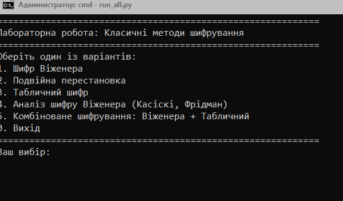
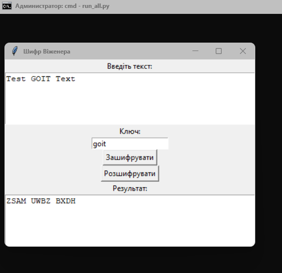
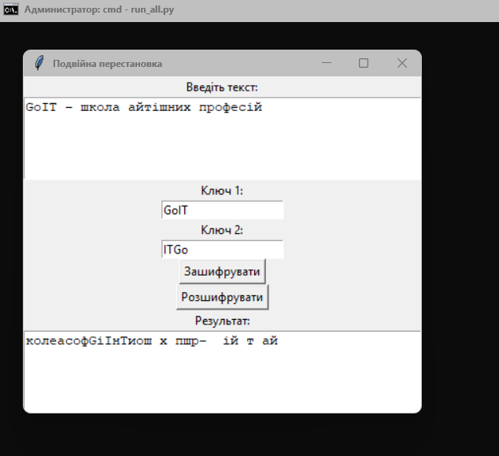
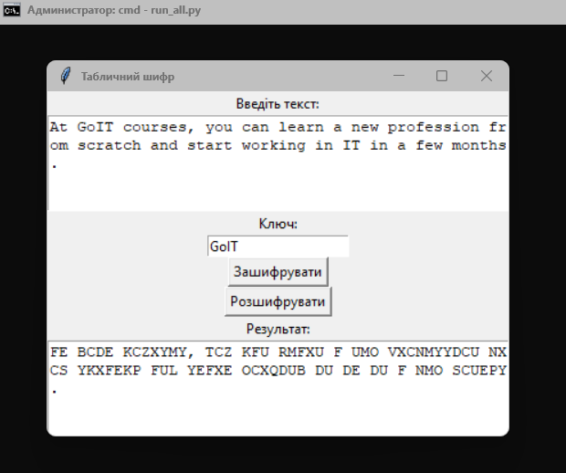
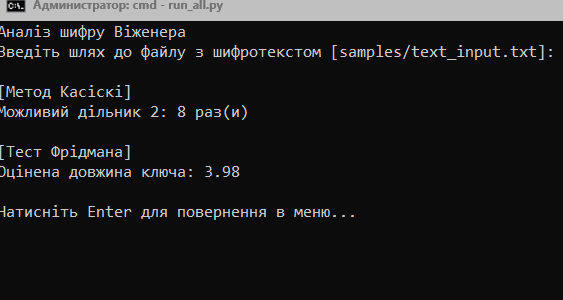
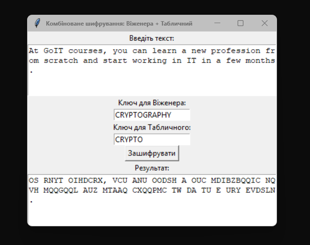

# Лабораторна робота: Класичні методи шифрування

Цей проєкт присвячено реалізації базових симетричних криптографічних алгоритмів, які були поширені в історії та застосовуються з освітньою метою. Ви можете шифрувати, дешифрувати та аналізувати текст за допомогою графічного інтерфейсу, використовуючи різні класичні методи.

## Реалізовані методи

1. **Шифр Віженера** — поліалфавітне шифрування з можливістю дешифрування.
2. **Подвійна перестановка** — шифрування на основі перестановки символів за двома ключами.
3. **Табличний шифр** — використання 5x5 матриці з ключовою фразою.
4. **Аналіз шифру Віженера** — метод Касіскі та тест Фрідмана (для визначення довжини ключа без його знання).
5. **Комбіноване шифрування** — послідовне застосування шифру Віженера та табличного шифру.

## Як користуватись

Запуск основного меню:

```
python run_all.py
```

Після цього ви зможете обрати один із режимів через текстове меню. Усі реалізації мають вбудований графічний інтерфейс (Tkinter).

## Структура проєкту

```
crypto_lab_1/
├── run_all.py                           # Головне меню
├── README.md                            # Цей файл
├── samples/
│   └── text_input.txt                   # Тестовий вхідний текст
├── vigenere_cipher/
│   ├── cipher.py                        # Шифрування/дешифрування Віженера
│   └── analyzer.py                      # Криптоаналіз Віженера
├── permutation_cipher/
│   └── double_permutation.py            # Подвійна перестановка
└── matrix_cipher/
    ├── table_cipher.py                  # Табличне шифрування
    └── combo_encrypt.py                 # Комбіноване шифрування
```

## Вимоги

- Python 3.7 або новіший
- `tkinter` (встановлюється разом із Python)

## Приклади

### 1. Головне меню
Після запуску `run_all.py` користувач бачить текстове меню з варіантами шифрування:


### 2. Шифрування Віженером
Графічний інтерфейс дозволяє ввести текст і ключ, а також отримати результат шифрування або дешифрування:


### 3. Подвійна перестановка
Приклад подвійного шифрування за ключами "SECRET" і "CRYPTO":


### 4. Табличний шифр
Шифрування з використанням ключової фрази у вигляді 5x5 матриці:


### 5. Комбіноване шифрування
Текст спочатку шифрується шифром Віженера, потім табличним шифром:


### 6. Аналіз шифру Віженера
Метод Касіскі та тест Фрідмана дозволяють визначити ймовірну довжину ключа без його знання:


## Автор

Робота виконана в рамках курсу з криптографії. Структура та реалізація — унікальні, всі інтерфейси українською мовою, код структурований по модулях для зручного повторного використання.
